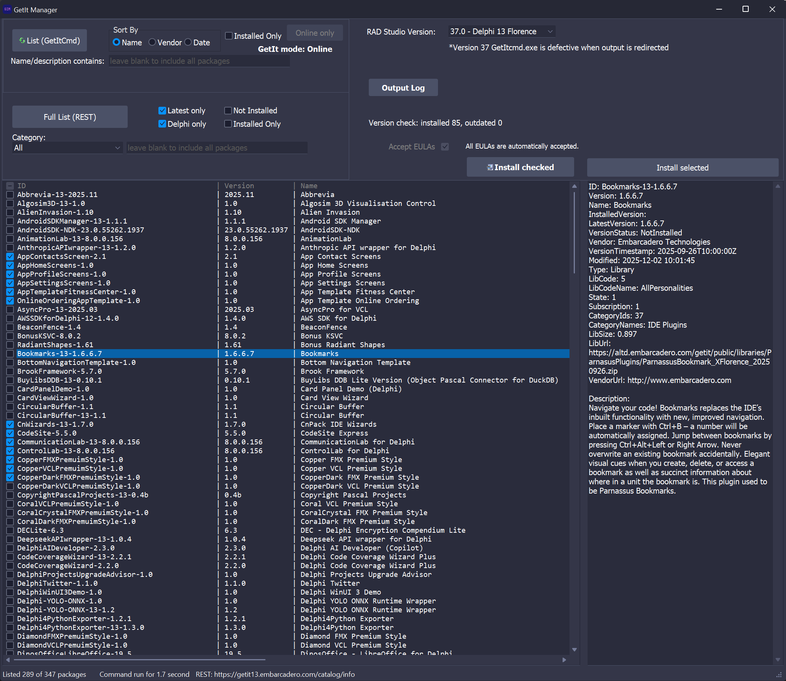

# GetItcmdGUI

[](https://www.embarcadero.com/products/rad-studio)
[]()
[](LICENSE)

GetItcmdGUI is a Windows VCL desktop tool for managing RAD Studio GetIt packages using two list sources:

- `GetItCmd.exe` (CLI integration)
- direct REST catalog calls

The goal is practical package management across multiple RAD Studio versions, with clear logs, filters, and install-state checks.

## Attribution

This project started from the original **AutoGetIt** idea and initial implementation by **David Cornelius**.

- Original project: [AutoGetIt](https://github.com/corneliusdavid/AutoGetIt)
- Original copyright: David Cornelius
- License: MIT

The current codebase has been significantly reworked and extended after the initial base import, while preserving attribution and the original MIT license terms.


## Key Features

- Dual list workflows, intentionally separated:
  - `List (GetItCmd)`
  - `List (REST)`
- Local post-processing for REST results:
  - text filter (`contains`, min 3 chars)
  - category filter (`All` + registry categories)
  - Delphi-only toggle
  - latest-version-only toggle
  - installed/not-installed filters
- Local sort menu over visible list (context menu)
- Install/uninstall/download flows through `GetItCmd`
- Output log and install log with save support
- Package install-state detection via registry scans
- UI feedback for command failures and warnings

## Supported RAD Studio Versions

The tool is designed around installed BDS versions detected on the machine.

Mainly tested in this project cycle:

- BDS 37.0 (Delphi 13)
- BDS 23.0 (Delphi 12)
- BDS 22.0 (Delphi 11)
- BDS 21.0 (Delphi 10.4)
- BDS 20.0 (Delphi 10.3)

Notes:

- `GetItCmd` syntax differs between legacy and newer versions (handled internally by flavor switch).
- REST request parameters are version-specific and may require future adjustments for new RAD Studio releases.

## Known Limitations

- `GetItCmd` behavior can be inconsistent across versions/environments.
- Current known issue: on some BDS 20 setups, `GetItCmd` may fail for list/install with server/access-violation errors even with correct command syntax.
- When `GetItCmd` list fails, the app shows: `GetIt list command failed, try REST.`
- REST and `GetItCmd` are not guaranteed to return identical datasets for every version.

## Build Requirements

- Windows
- Embarcadero RAD Studio (Win64 target)
- [DOSCommand](https://github.com/TurboPack/DOSCommand)

## Build

From a RAD Studio command prompt (or with `rsvars.bat` loaded):

```bat
msbuild GetItcmdGUI.dproj /t:Build /p:Config=Debug /p:Platform=Win64
```

## Usage

### 1. Choose RAD Studio version

Select the detected BDS version from the combo box.

### 2. Choose list source

- `List (GetItCmd)`
  - Uses `GetItCmd.exe`
  - Uses command-line filters/sort parameters
  - REST-only filters are disabled in this mode
- `List (REST)`
  - Downloads catalog via REST
  - Applies filters and selection logic locally

### 3. Apply filters/sort

- GetItCmd mode: command parameters + local sort menu
- REST mode: full local filter stack + local sort menu

### 4. Run actions

- Install selected
- Uninstall selected
- Download highlighted package

Use **Output Log** and **Install Log** to inspect or save diagnostics.

## Logs and Troubleshooting

- **Output Log**: list command output, REST diagnostics, warnings/errors
- **Install Log**: install/uninstall operation output
- If list fails with `GetItCmd`, retry with REST for package browsing.

## Repository Notes

This README is for the standalone `GetItcmdGUI` repository layout, where `GetItcmdGUI` is the project root.

## Legal

See:

- [LICENSE](LICENSE)
- [NOTICE](NOTICE)
- [CHANGELOG](CHANGELOG.md)




